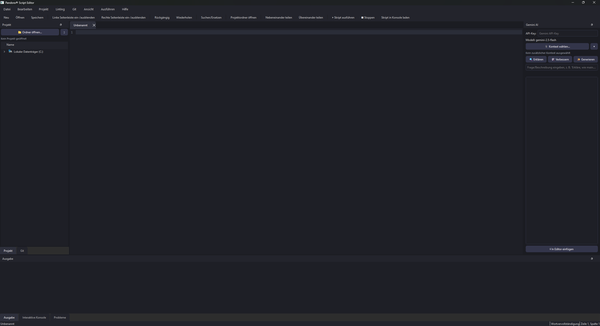

# Pandora® Script Editor

   

Dieses Repository enthält den **Pandora® Script Editor** sowie den kompletten **Pandora-Werkzeugkasten** — eigenständige PyQt6-Tools, die über das Menü „Werkzeuge“ direkt aus dem Editor heraus gestartet werden können. Diese Datei fasst alle README.md-Dateien des Projekts an einer Stelle zusammen; für die installierbaren Python-Abhängigkeiten siehe [`requirements.txt`](requirements.txt) im selben Verzeichnis.

## Inhaltsverzeichnis

- [Pandora® | Script Editor (Haupt-Editor)](#pandora-script-editor-haupt-editor)
- [Werkzeugkasten](#werkzeugkasten)
- [Pandora® | Config Editor](#pandora-config-editor)
- [Pandora® | Crypto & Encoding Utility](#pandora-crypto-encoding-utility)
- [Pandora® | Environment & Dependency Manager](#pandora-environment-dependency-manager)
- [Pandora® | md Editor](#pandora-md-editor)
- [Pandora® | PCB Editor](#pandora-pcb-editor)
- [Pandora® | Code Snippet Vault](#pandora-code-snippet-vault)
- [Pandora® | SQL Config Editor & Validator](#pandora-sql-config-editor-validator)
- [Pandora® | UI Asset & Color Studio](#pandora-ui-asset-color-studio)
- [Pandora® | UI Forge](#pandora-ui-forge)
- [Pandora® | Web Editor](#pandora-web-editor)
- [Pandora® | Structure Creator](#pandora-structure-creator)

---

## Pandora® Script Editor (Haupt-Editor)


# Pandora® Script Editor

Ein schlanker, benutzerfreundlicher Python-Script-Editor auf Basis von **PyQt6** – mit Login-Bildschirm und einer Sammlung begleitender Pandora-Tools.




## Funktionen

- Mehrere Dateien in Tabs
- Zeilennummern + aktuelle Zeile hervorgehoben
- Python-Syntaxhervorhebung
- Neu / Öffnen / Speichern / Speichern unter
- Rückgängig / Wiederholen / Ausschneiden / Kopieren / Einfügen
- Suchen & Ersetzen
- Skript ausführen (per Subprocess) mit Ausgabe-Konsole
- Zoom (Schriftgröße ändern)
- Split-Screen: zwei Editor-Bereiche nebeneinander oder übereinander, jeweils mit eigenen Tabs
- Dunkles, modernes Erscheinungsbild
- Statusleiste mit Zeile/Spalte und Dateistatus
- Projekt-Panel: Ordner öffnen, Dateibaum, Navigation, Neu/Umbenennen/Löschen
- Code-Intelligenz: Autovervollständigung (Wortschatz + optional Jedi bei installiertem `jedi`, Strg+Leertaste für kontextbezogene Vorschläge)
- Linting & Fehlerprüfung: Hintergrundprüfung (Syntaxfehler über `ast`, zusätzlich Stil-/Logikwarnungen über optionales `pyflakes`), Wellenlinien im Editor, "Probleme"-Panel mit Sprung zur Fehlerzeile
- Git-Integration: Repository-Status, Staged/Unstaged-Dateien, Stagen/Unstagen/Verwerfen, Diff-Ansicht, Commit, Push, Pull (per `git`-CLI)
- Gemini-Integration (`gemini-3.5-flash`): Code erklären, verbessern/reparieren, aus Beschreibung generieren, freier Chat-Prompt; Kontext aus mehreren offenen Dateien und/oder einem ganzen Ordner wählbar
- Interaktive Python-Konsole (persistenter Namensraum, Verlauf mit ↑/↓)
- Icon-Theme: FontAwesome-Icons über optionales `qtawesome` (mit Emoji-Fallback)
- Login-Bildschirm (`login_ui.py`) vor dem Start des Editors

## Start

```bash
pip install PyQt6
python pandora_script_editor.py
```

### Optionale Abhängigkeiten

| Paket | Zweck |
|---|---|
| `jedi` | kontextbezogene Autovervollständigung |
| `pyflakes` | erweiterte Lint-Warnungen |
| `qtawesome` | FontAwesome-Icon-Theme |
| `git`-CLI im `PATH` | Git-Integration im Editor |

### Desktop-Integration (Linux / Kali)

```bash
./install_pandora_editor_desktop.sh
```
Installiert Icon + `.desktop`-Datei, sodass der Editor im Anwendungsmenü erscheint.

## Enthaltene Zusatz-Tools

Im Ordner `Pandor Script Editor Tools/` befinden sich weitere eigenständige Pandora-Werkzeuge:

- `json yaml editor`
- `pandora_crypto_tool`
- `pandora_env_dependency_manager`
- `pandora_md_editor`
- `pandora_pcb_editor`
- `pandora_structure_creator`
- `pandora_snippet_vault`
- `pandora_sql_config_editor`
- `pandora_ui_asset_color_studio`
- `pandora_ui_forge`
- `pandora_web_editor`

Jedes Tool ist einzeln über sein jeweiliges Hauptskript im Unterordner startbar.

## Projektstruktur

```
Pandora Script Editor/
├── pandora_script_editor.py           # Hauptanwendung
├── login_ui.py                        # Login-Bildschirm
├── install_pandora_editor_desktop.sh  # Desktop-Integration (Linux)
├── pandora_editor_icon.png
└── Pandor Script Editor Tools/        # Begleitende Zusatz-Tools
```

## Lizenz

Siehe [LICENSE](LICENSE).


---

## Werkzeugkasten

Die folgenden Werkzeuge liegen unter `Pandor Script Editor Tools/` und werden vom Haupt-Editor aus über das Menü „Werkzeuge“ als eigenständige Prozesse gestartet (Pfad zur jeweiligen Einstiegsdatei wird beim ersten Aufruf abgefragt und gemerkt). Ausnahme: der **Code Snippet Vault** wird zusätzlich direkt in den Editor-Prozess eingebunden, damit „Quick-Insert“ an der Cursor-Position einfügen kann.

### ⧉ Pandora Config Editor


Visueller JSON/YAML-Konfigurations-Editor & Validator mit dunklem Neon-("Pandora")-Theme,
gebaut mit PyQt6. Läuft flüssig auf einem Raspberry Pi 4B (8GB) unter Kali Linux.

### Features

- **Dynamisches Formular**: Aus jeder beliebig verschachtelten JSON/YAML-Datei werden
  automatisch passende Eingabefelder erzeugt — Textfelder, Zahlenfelder, Checkboxen,
  Dropdowns (bei Enum-Werten im Schema) sowie Listen-Editoren mit +/- Buttons.
- **Live-Vorschau**: Split-Screen rechts zeigt den aktuellen Stand als formatierten
  JSON- oder YAML-Code mit einfachem Syntax-Highlighting, in Echtzeit synchronisiert.
- **Schema-Validierung**: Wird ein JSON-Schema geladen, wird jede Änderung sofort
  gegen das Schema geprüft (`jsonschema`-Bibliothek). Ungültige Felder werden rot markiert.
- **Automatisches Backup**: Vor jedem Speichern wird eine Zeitstempel-Kopie der
  Originaldatei in einem versteckten Ordner `.pandora_backups/` neben der Datei abgelegt.
- **JSON ⇄ YAML**: Umschalten des Ausgabeformats über die Toolbar, unabhängig vom
  ursprünglichen Dateiformat.

### Installation auf dem Raspberry Pi 4B (Kali Linux)

```bash
sudo apt update
sudo apt install -y python3-pip python3-venv

## (empfohlen) virtuelle Umgebung anlegen
python3 -m venv ~/pandora-env
source ~/pandora-env/bin/activate

pip install --break-system-packages PyQt6 PyYAML jsonschema
```

> Hinweis: PyQt6 muss ggf. als vorkompiliertes Wheel für ARM64 vorliegen.
> Falls die Installation über pip auf dem Pi sehr lange dauert oder fehlschlägt,
> alternativ über die Paketquellen installieren:
> ```bash
> sudo apt install -y python3-pyqt6
> ```

### Start

```bash
python3 pandora_config_editor.py                          # leer starten
python3 pandora_config_editor.py beispiel_config.json      # Datei direkt öffnen
python3 pandora_config_editor.py beispiel_config.json --schema beispiel_schema.json
```

### Bedienung

| Aktion              | Beschreibung                                                       |
|---------------------|---------------------------------------------------------------------|
| 📂 Öffnen           | JSON/YAML-Datei laden, Formular wird automatisch generiert          |
| 🧩 Schema laden     | Optionales JSON-Schema für Live-Validierung laden                   |
| ↺ Neu laden         | Aktuell geladene Datei erneut von der Platte einlesen (verwirft Änderungen) |
| JSON / YAML         | Ausgabeformat der Vorschau & beim Speichern umschalten               |
| ✔ Validieren        | Manuelle Vollvalidierung mit Detail-Fehlerliste                      |
| 💾 Speichern        | Erstellt zuerst ein Backup, validiert, schreibt dann die Datei       |

### Mitgelieferte Beispieldateien

- `beispiel_config.json` — Beispiel-Serverkonfiguration mit verschachtelten Objekten,
  einer einfachen Liste (`allowed_ips`) und einer Liste von Objekten (`users`).
- `beispiel_schema.json` — passendes JSON-Schema mit Typ-, Bereichs- und Enum-Regeln
  (z. B. `log_level` wird dadurch automatisch als Dropdown angezeigt).

### Hinweise zur Architektur

- `DynamicFormBuilder` baut rekursiv verschachtelte `QGroupBox`-Strukturen für jedes
  `dict`-Objekt auf.
- `ListEditor` verwaltet Arrays: Skalare Listen (Strings/Zahlen) und Listen aus Objekten
  werden beide unterstützt, inkl. Hinzufügen/Entfernen einzelner Einträge.
- `ScalarField` wählt automatisch das passende Widget (`QCheckBox` für bool,
  `QSpinBox`/`QDoubleSpinBox` für Zahlen, `QComboBox` bei `enum` im Schema, sonst `QLineEdit`).
- Validierung läuft bei jeder Änderung im Hintergrund (`Draft7Validator`), Fehler werden
  per Pfad auf das jeweilige Feld zurückgeführt und rot markiert.
- Performance: Für den Pi 4B wurde bewusst auf schwergewichtige Web-Views o.ä. verzichtet —
  reines natives Qt-Widget-Tree hält den RAM- und CPU-Verbrauch niedrig.

---

### Pandora® | Crypto & Encoding Utility


Eigenständiges PyQt6-Werkzeug für alltägliche Kryptografie- und Encoding-
Aufgaben in der Entwicklung: Base64/Hex/URL/HTML-Kodierung, Hash- &
HMAC-Generierung, JWT-Inspektion sowie ein RegEx-Tester. Läuft — analog
zum SQL Config Editor & Web Editor — als eigenständiger Prozess und wird
vom Pandora Script Editor über „Werkzeuge → Crypto & Encoding Utility“
gestartet.

### Installation

```bash
python3 -m venv venv
source venv/bin/activate
pip install -r requirements.txt
```

### Start

```bash
python3 pandora_crypto_tool.py
```

### Funktionsübersicht

Die Anwendung ist in vier Tabs gegliedert:

#### Encoder / Decoder
Kodieren/Dekodieren von Text in Base64, Hex, URL- und HTML-Encoding.

#### Hash & Checksum
Berechnung gängiger Hash-Werte sowie HMAC-Signaturen (mit wählbarem
Hash-Algorithmus) für beliebigen Eingabetext.

#### JWT & Token
Zerlegt JSON Web Tokens in Header/Payload und prüft HMAC-basierte
Signaturen (HS256 / HS384 / HS512) gegen ein bekanntes Secret.

#### RegEx Tester
Testet reguläre Ausdrücke live gegen einen Beispieltext, inklusive
Such-/Ersetzen-Funktion (`re.sub`) mit Vorschau des Ergebnisses.

### Erweiterbarkeit

Die eigentliche Logik liegt entkoppelt von der GUI in `core/` (`encoding.py`,
`hashing.py`, `jwt_tool.py`, `regex_tool.py`) und lässt sich dort unabhängig
von PyQt6 testen und erweitern.

---

### Pandora® | Environment & Dependency Manager


Eigenständiges PyQt6-Werkzeug zur Verwaltung von Python-Virtualenvs sowie
pip-/npm-Abhängigkeiten. Läuft — analog zu den anderen Pandora-Werkzeugen
(Crypto Utility, SQL Config Editor, UI Asset & Color Studio) — als
eigenständiger Prozess und wird vom Pandora Script Editor über
„Werkzeuge → Environment & Dependency Manager“ gestartet.

### Installation

```bash
python3 -m venv venv
source venv/bin/activate
pip install -r requirements.txt
```

### Start

```bash
python3 pandora_env_dependency_manager.py
```

### Funktionsübersicht

Die Anwendung ist in drei Tabs gegliedert:

#### Virtualenv Control
Anlegen, Aktivieren und Verwalten von Python-Virtualenvs für ein
Projektverzeichnis.

#### Package Installer
Installation von pip- bzw. npm-Paketen in die aktive Umgebung, inklusive
Statusrückmeldung des laufenden Installationsprozesses.

#### Abhängigkeits-Übersicht
Übersicht der installierten Pakete samt Versionen für die gewählte
Umgebung.

### Erweiterbarkeit

Die eigentliche Logik liegt entkoppelt von der GUI in `core/`
(`venv_manager.py`, `package_installer.py`, `dependency_overview.py`) und
lässt sich dort unabhängig von PyQt6 testen und erweitern.

---

### Pandora® md Editor


Ein schlanker Split-Screen-Markdown-Editor im **Darkred**-Design – geschrieben mit
Python 3 und PyQt6. Links Eingabe (mit Syntax-Highlighting), rechts Live-Vorschau
als gerendertes HTML, inklusive PDF-Export.

by **AKI_SystemDown®** — Teil der Pandora-Projektreihe

### Features

- Zwei-Fenster-Ansicht (Splitter): `QTextEdit`-Editor links, `QWebEngineView`-Vorschau rechts
- Live-Rendering während des Tippens (entprellt, 150 ms)
- Markdown-Syntax-Highlighting im Editor (Überschriften, Fett/Kursiv, Code, Links, Listen, Zitate, `---`)
- Menüleiste & Toolbar: Neu, Öffnen, Speichern, Speichern unter, PDF-Export, HTML-Export, Beenden
- Markdown-Parsing über die `markdown`-Bibliothek (Extras: Tabellen, Fenced Code Blocks, `codehilite` für Code-Syntax-Highlighting im HTML, TOC, sane_lists, nl2br)
- PDF-Export direkt aus der gerenderten Vorschau (`QWebEnginePage.printToPdf`, A4)
- Zusätzlicher HTML-Export der gerenderten Ansicht
- Modernes Darkred-QSS-Theme, Logo im Fenster-Icon & Kopfzeile

### Projektstruktur

```
pandora_md_editor/
├── main.py            # Einstiegspunkt
├── editor.py           # Hauptfenster (Split-Screen, Datei-/PDF-Logik)
├── highlighter.py       # QSyntaxHighlighter für Markdown im Editor
├── theme.py             # Darkred-QSS + HTML/CSS-Vorlage für die Vorschau
├── requirements.txt
└── assets/
    ├── logo.png          # Fenster-Icon / Kopfzeilen-Logo
    └── aki_logo.gif       # Original-Logo-Datei
```

### Installation

```bash
pip install -r requirements.txt
```

oder einzeln:

```bash
pip install PyQt6 PyQt6-WebEngine markdown Pygments
```

> **Hinweis (Linux/Raspberry Pi):** `PyQt6-WebEngine` benötigt ggf. zusätzliche
> Systembibliotheken (Qt WebEngine/Chromium-Abhängigkeiten). Falls der Import
> fehlschlägt: `sudo apt install libnss3 libxcomposite1 libxdamage1 libxrandr2 libgbm1 libxkbcommon0`

### Ausführen

```bash
cd pandora_md_editor
python main.py
```

### Bedienung

| Aktion              | Shortcut     |
|---------------------|--------------|
| Neu                 | Strg+N       |
| Öffnen              | Strg+O       |
| Speichern           | Strg+S       |
| Speichern unter     | Strg+Umschalt+S |
| Als PDF exportieren | Strg+P       |

Die Vorschau rendert automatisch, sobald der Text im linken Editor geändert wird
(mit kurzer Verzögerung von 150 ms, um bei langen Dokumenten flüssig zu bleiben).

---

### Pandora® - PCB Editor


### Installation (Raspberry Pi 4B / Kali Linux)
```bash
pip install -r requirements.txt --break-system-packages
python3 pandora_pcb_editor.py
```

### Enthalten (MVP)
- Pandora-Cyberpunk-Dark-Theme (Cyan/Magenta/Purple auf Schwarz)
- Layerverwaltung: Top/Bottom Copper, Top/Bottom Silkscreen, Drill, Board Outline
  (Sichtbarkeit + aktiver Layer per Dock links)
- QGraphicsScene/View-Canvas mit Raster (einstellbar, Standard 1.27mm), Snap-to-Grid, Zoom via Mausrad
- Werkzeuge: Auswählen, Leiterbahn (Mehrsegment, Doppelklick beendet), Pad, Via,
  Footprint-Platzhalter (Körper + Pins + Referenz), Board-Umriss (Polygon)
- Undo/Redo über QUndoStack (Hinzufügen, Löschen, Verschieben)
- Eigenschaften-Dock: Position (X/Y in mm), Layer, Netz – live editierbar
- Netzliste: einfache Netzverwaltung (Name, Farbe)
- Projekt speichern/laden als JSON (`.pandora`)
- Vollständiger Gerber-X2- + Excellon-Export (siehe eigener Abschnitt unten)

### Rastnest-Gird
- **Ratsnest**: automatische Luftlinien (gestrichelt) je Netz, berechnet per
  Minimal-Spannbaum (MST) über alle Pads/Vias eines Netzes. Bereits durch Traces
  verbundene Punkte werden erkannt und nicht erneut verbunden. Live-Update nach
  Verschieben (Auswahl-Modus), Hinzufügen/Löschen (Undo/Redo) und Projekt-Laden.
  Ein/Aus-Schalter in der Toolbar, manuelles Neuberechnen über Menü „Werkzeuge“.
- **Netz-Zuweisung**: im Eigenschaften-Dock kann für Pads/Vias/Traces per Dropdown
  ein Netz zugewiesen werden (inkl. „kein Netz“).
- **Design Rule Check (DRC)**: neues Dock rechts mit einstellbaren Regeln
  (Mindest-Clearance, Mindest-Leiterbahnbreite, Mindest-Bohrdurchmesser).
  Prüft Kupfer-Elemente unterschiedlicher Netze auf demselben Layer auf
  Abstandsverletzungen (Näherung über Bounding-Box-Distanz) sowie zu dünne Traces
  und zu kleine Bohrungen. Verstöße sind anklickbar → Element(e) werden selektiert
  und die Ansicht zoomt darauf.

### Footprint-Bibliothek
- **Echte Footprints statt Platzhalter**: neues Dock „Footprint-Bibliothek“ (links,
  tabbed mit dem Layer-Dock) mit 36 vordefinierten Footprints in vier Kategorien
  (SMD Passiv, SMD Diode/Transistor, SMD IC, THT, Stiftleisten, Mechanik) —
  u. a. R/C/LED 0402–1206, SOD-123, SOT-23/-23-5/-223, SOIC-8/14/16,
  TSSOP-8/16, DIP-8/14/16, TO-220-3, Stiftleisten 1x02–1x10 & 2x05/2x10,
  Bohrungen M2.5/M3. Suchfeld zum Filtern nach Name.
- Pads jedes Footprints sind **echte, netzfähige PadItem-Elemente** (kein reiner
  Platzhalter mehr) — Ratsnest, DRC und Gerber-Lite-Export berücksichtigen sie
  wie frei platzierte Pads. Netzzuweisung je Pin erfolgt im Eigenschaften-Dock
  über eine „Pins“-Liste, sobald ein Footprint ausgewählt ist.
- Auswahl eines Footprints in der Bibliothek aktiviert automatisch das
  Footprint-Werkzeug; jeder Klick auf dem Board platziert eine Instanz mit
  automatisch hochgezähltem Referenzbezeichner (R1, R2, U1, …) auf Basis des
  Footprint-Präfixes. Ein optionales „Wert“-Feld (z. B. „10k“, „100nF“) wird
  bei der Platzierung übernommen.
- Eigenschaften-Dock für Footprints: Referenz und Wert live editierbar,
  Rotation (0/90/180/270°), Anzeige des zugrunde liegenden Bibliotheksschlüssels.
- **Rotation**: „Bauteil drehen“ (Strg+R) dreht die aktuelle Auswahl um 90°,
  mit Undo/Redo-Unterstützung.
- Alt-Projekte (vor der Footprint-Bibliothek, ohne `footprint_key`) werden
  beim Laden automatisch mit einem generischen, aber ebenfalls netzfähigen
  Footprint rekonstruiert.
- Hinweis: Pad-Maße sind praxistaugliche Näherungswerte, keine datenblatt-
  geprüften Fertigungs-Footprints.

### Autorouter
- **Grid-/Maze-Router (A*)**: neues Dock „Autorouter“ mit einstellbarer
  Raster-Zellgröße, Mindest-Clearance, Trace-Breite und Ziel-Layer (Top/Bottom Copper).
- Nimmt alle offenen Ratsnest-Verbindungen, rasterisiert Kupfer-Elemente fremder Netze
  (inkl. Clearance-Puffer) als Hindernisse und sucht je Verbindung per A*
  (8-Wege-Bewegung) den kürzesten freien Pfad.
- Gefundene Pfade werden kollinear vereinfacht und als echte Traces eingefügt
  (ein Undo-Schritt für den gesamten Lauf über `beginMacro`/`endMacro`).
- Log-Liste zeigt pro Netz ✓ (geroutet) oder ✗ (kein Pfad / Raster zu groß).

### Vollständiger Gerber X2 + Excellon-Export
- **Menü „Projekt → Gerber X2 / Excellon-Export…“** exportiert in ein gewähltes
  Verzeichnis sechs Dateien: `pandora_top_copper.gbr`, `pandora_bottom_copper.gbr`,
  `pandora_top_silk.gbr`, `pandora_bottom_silk.gbr`, `pandora_outline.gbr` und
  `pandora_drill_pth.drl`.
- **Gerber X2 (RS-274X + Attribute)**: jede `.gbr`-Datei enthält Datei-Attribute
  (`%TF.GenerationSoftware*%`, `%TF.CreationDate*%`, `%TF.Part*%`,
  `%TF.FileFunction*%`, bei Copper zusätzlich `%TF.FilePolarity*%`) sowie
  Apertur-Attribute (`%TA.AperFunction*%`/`%TD*%`) für SMD-Pads (`SMDPad,CuDef`),
  THT-Pads (`ComponentPad`), Vias (`Via`), Leiterbahnen (`Conductor`) und
  Silkscreen-Konturen (`Legend`). Koordinatenformat `%FSLAX46Y46*%` (4.6, mm,
  Leading-Zero-Suppression), Aperturen werden dedupliziert (gleiche
  Form/Größe/Funktion → gleicher D-Code).
- **Kupfer-Layer**: Pads (rect/round/oval → R-/C-/O-Apertur) als Flash (D03),
  Vias als Flash mit eigener Via-Apertur, Leiterbahnen als D01/D02-Interpolation
  mit einer Rundapertur passend zur Trace-Breite. Footprint-Kind-Pads werden
  über `scenePos()` in absolute Board-Koordinaten aufgelöst (korrekt auch bei
  gedrehten Footprints).
- **Silkscreen-Layer** (`Legend,Top`/`Legend,Bot`): Körperumriss jedes
  Footprints als geschlossener Linienzug, mit Referenzbezeichner als
  Klartext-Kommentar (`G04 Bauteil ...*`) davor.
- **Board-Outline** als `Profile,NP`-Layer: geschlossener Linienzug aus dem
  Board-Umriss-Polygon.
- **Excellon-Bohrdatei** (`METRIC,LZ`, `M48`/`%`/`G90`/`G05`/`M30`): alle Vias
  und Pads mit `drill_mm > 0` werden nach Durchmesser zu Werkzeugen (`T01`, `T02`, …)
  gruppiert und als PTH (durchkontaktiert) exportiert.
- **Einschränkungen**: Footprint-Pads liegen intern immer auf Top-Copper (siehe
  bekannte Limitierung bei Multi-Layer-THT-Pads), es gibt keine automatische
  NPTH-Trennung (z. B. reine Befestigungsbohrungen werden ebenfalls als PTH
  exportiert), und es wird kein separates `.gbrjob`-Jobfile erzeugt.

### 3D-Vorschau
- **Menü „Werkzeuge → 3D-Vorschau…“** (`Strg+3`) bzw. Toolbar-Button „3D-Vorschau“
  öffnet ein eigenes Fenster mit einer 3D-Darstellung des aktuellen Boards,
  gerendert per `matplotlib` (mplot3d).
- **Dargestellte Geometrie**: Board-Substrat als extrudiertes Prisma aus dem
  Board-Umriss (FR4-grün, Standardstärke 1,6 mm; ohne gezeichneten Umriss wird
  automatisch die Bounding-Box aller Elemente + Rand verwendet), Kupfer-Elemente
  (Pads, Vias, Leiterbahnen) auf Top-/Bottom-Copper in den jeweiligen
  Layerfarben, Bohrungen als ausgesparte Zylinder durch das gesamte Board,
  sowie Footprint-Silkscreen-Umrisse als dünne Bänder auf der Bauteilseite.
- **Ansichten**: Buttons für „Isometrisch“, „Oben (Bestückungsseite)“, „Unten“
  und „Neu berechnen“; frei drehbar/zoombar per Maus (Standard-mplot3d-Steuerung).
- **Einschränkung**: kein vollwertiger 3D-Renderer (kein STEP-/Bauteilkörper-Import,
  keine Textur-/Glanz-Darstellung) — dient als schneller visueller Eindruck von
  Lagenlage, Bestückungsseite und grober Bohrungslage, nicht als Fertigungs-Review.
- **Abhängigkeit**: benötigt `matplotlib` (siehe `requirements.txt`). Ist
  `matplotlib` nicht installiert, zeigt der Dialog einen Installationshinweis
  statt der 3D-Ansicht an.

### Roadmap / noch offen (bewusst nicht im MVP, da Enterprise-Umfang sehr groß ist)
- Exaktes Polygon-Clearance-Modell (aktuell Bounding-Box-Näherung, keine Rotationen)
- Autorouter: kein Layer-Wechsel per Via während des Routings, kein Push-and-Shove,
  kein Rip-up/Re-Route bei Sackgassen; Raster wird pro Segment neu aufgebaut
  (nicht performance-optimal bei sehr vielen Netzen/großen Boards)
- Footprint-Bibliothek: KiCad-Import, benutzerdefinierte/editierbare Footprints,
  echte THT-Pads über mehrere Layer (aktuell nur als Top-Copper-Pad realisiert),
  Courtyard/Fab-Layer, maßstabsgetreue Referenzbeschriftung (aktuell fixe
  Bildschirmgröße statt mm-Skalierung)
- Mehrschicht-PCBs (>2 Layer, interne Layer)
- Undo/Redo auch für Trace-Punkt-Bearbeitung, Layer-Sichtbarkeit und
  Eigenschaften-Dock-Bearbeitungen (Position/Ref/Wert/Rotation direkt im Dock)
- 3D-Vorschau: echter OpenGL-Renderer mit Beleuchtung/Texturen statt
  matplotlib-Extrusion, STEP-Export/Import von Bauteilkörpern

### Projekt-Icon
Das Anwendungsicon liegt unter [`assets/icon.png`](assets/icon.png) (PNG, für
Fenster-/Taskleisten-Icon unter Linux/macOS) und [`assets/icon.ico`](assets/icon.ico)
(Mehrfachauflösung 16–256 px, für Windows-Fenstericon und `.exe`-Icon beim
PyInstaller-Build, siehe unten). Beide werden automatisch beim Programmstart
geladen (`app.setWindowIcon(...)` in `main()` sowie `MainWindow.__init__`).

### Windows-Build: eigenständiges Programm mit PyInstaller (`--onedir`)
Um aus dem Python-Quellcode ein eigenständiges Windows-Programm zu bauen (ohne
dass auf dem Zielrechner Python installiert sein muss), wird
[PyInstaller](https://pyinstaller.org/) im `--onedir`-Modus verwendet. Dabei
entsteht ein Ordner mit der `.exe` und allen Abhängigkeiten (im Gegensatz zu
`--onefile`, was eine einzelne, aber langsamer startende `.exe` erzeugt).

#### 1. Voraussetzungen installieren
In einer **PowerShell** oder **Eingabeaufforderung (cmd)** unter Windows, im
Projektordner (dort, wo `pandora_pcb_editor.py` liegt):

```powershell
py -m venv venv
venv\Scripts\activate
pip install -r requirements.txt
pip install pyinstaller
```

> Falls `py` nicht gefunden wird: Python von [python.org](https://www.python.org/downloads/windows/)
> installieren und beim Setup **„Add python.exe to PATH“** aktivieren.

#### 2. `--onedir`-Build erstellen
Mit aktivierter virtueller Umgebung (`venv`) den Build starten:

```powershell
pyinstaller --onedir --windowed --name "Pandora_PCB_Editor" --icon assets\icon.ico pandora_pcb_editor.py
```

Bedeutung der Optionen:
- `--onedir` – erzeugt **einen Ordner** (nicht eine einzelne Datei) mit der
  `.exe` und allen DLLs/Abhängigkeiten. Startet spürbar schneller als
  `--onefile`, da beim Start nichts erst in ein Temp-Verzeichnis entpackt
  werden muss.
- `--windowed` – unterdrückt das schwarze Konsolenfenster im Hintergrund
  (passend für eine GUI-Anwendung wie diese).
- `--name` – legt den Namen des Ausgabeordners/der `.exe` fest.
- `--icon` – setzt das `.ico`-Icon der erzeugten `.exe`.

#### 3. Ergebnis
Nach erfolgreichem Build liegt das fertige Programm unter:

```
dist\Pandora_PCB_Editor\Pandora_PCB_Editor.exe
```

Der komplette Ordner `dist\Pandora_PCB_Editor\` muss zusammenbleiben (die
`.exe` benötigt die danebenliegenden DLLs/Ressourcen) — er kann als Ganzes
kopiert, gezippt oder z. B. per Inno Setup/NSIS zu einem Installer verpackt
werden.

#### Hinweise
- `build\` und `dist\` sowie die von PyInstaller erzeugte `.spec`-Datei sind
  generierte Build-Artefakte und daher in `.gitignore` ausgeschlossen.
- Bei Antivirus-/SmartScreen-Warnungen bei frisch erzeugten, unsignierten
  `.exe`-Dateien handelt es sich um ein bekanntes PyInstaller-Verhalten
  (fehlende Code-Signatur) und keinen Hinweis auf Schadsoftware im Quellcode.
- Für eine einzelne portable Datei statt eines Ordners kann alternativ
  `--onefile` statt `--onedir` verwendet werden (Start dauert dann etwas
  länger, da bei jedem Programmstart in einen Temp-Ordner entpackt wird).

---

### Pandora® Code Snippet Vault


Intelligente, sprachübergreifende Code-Bibliothek für den Pandora Script
Editor. Kann sowohl **eigenständig** gestartet werden (Bibliothek
verwalten/durchsuchen) als auch **direkt in den Prozess des Pandora
Script Editors** geladen werden (per `importlib`), damit „Quick-Insert“
Snippets direkt an der Cursor-Position im aktiven Editor einfügen kann —
ein per `subprocess` gestartetes, separates Fenster hätte darauf keinen
Zugriff.

### Installation

```bash
python3 -m venv venv
source venv/bin/activate
pip install -r requirements.txt
```

### Start (eigenständig)

```bash
python3 pandora_snippet_vault.py
```

Im eigenständigen Modus kopiert „Einfügen“ das Snippet in die
Zwischenablage, statt es direkt in einen Editor einzufügen.

### Funktionsübersicht

- **Multi-Language Support**: freie Kategorisierung nach Sprache (Python,
  Lua, JavaScript, …) und Kategorie/Framework, zusätzlich Tags pro Snippet.
- **Vault-Browser**: Suche/Filter nach Sprache, Kategorie und Freitext,
  Live-Vorschau, Anlegen/Bearbeiten/Duplizieren/Löschen.
- **Quick-Insert-Popup**: schmales Suchfenster (per Tastenkombination
  `Strg+Alt+I` im Haupteditor geöffnet), Enter fügt das oberste/gewählte
  Snippet direkt an der aktuellen Cursor-Position ein.
- **Variable Placeholders**: Platzhalter der Form `${name}` bzw.
  `${name:default}` im Snippet-Code werden beim Einfügen automatisch
  erkannt und in einem kleinen Formular abgefragt.
- **Persistente Bibliothek** als JSON-Datei (`~/.pandora_snippet_vault.json`),
  unabhängig vom Speicherort dieses Skripts.

### Integration in den Pandora Script Editor

Dieses Modul ist so gebaut, dass es sowohl eigenständig gestartet werden
kann als auch per `importlib` direkt vom Pandora Script Editor geladen
wird. Siehe `open_snippet_vault()` / `quick_insert_snippet()` in
`pandora_script_editor.py`.

---

### Pandora® | SQL Config Editor & Validator


Vollständiger visueller Datenbankeditor für SQLite- und MariaDB-Datenbanken:
dynamisch generierte Formulare (inkl. Fremdschlüssel-Dropdowns), Live-SQL-
Vorschau, Schema-Validierung, Paginierung, Volltextsuche, Sortierung,
Tabellen-/Spaltenverwaltung, CSV-Import/-Export und automatisches Backup vor
jedem Schreibvorgang. Läuft auf Raspberry Pi 4B (8GB) unter Kali Linux, im
Pandora®-Cyberpunk-Stil.

### Installation

```bash
python3 -m venv venv
source venv/bin/activate
pip install -r requirements.txt
```

Für MariaDB-Backups zusätzlich `mariadb-client` installieren (liefert `mysqldump`):

```bash
sudo apt install mariadb-client
```

### Start

```bash
python3 main.py
```

### Funktionsübersicht

#### Verbindung & Datei
- **Backend-Erkennung**: Beim Start wird geprüft, ob lokal ein MariaDB/MySQL-Server
  läuft (Port 3306 + systemd-Status). Der Status erscheint in der Statuszeile.
- **Menüleiste „Datei“** + Toolbar: SQLite öffnen (Strg+O), Mit MariaDB
  verbinden (Strg+Umschalt+O), Speichern (Strg+S), Speichern unter…
  (Strg+Umschalt+S, Kopie bzw. Dump), Backup jetzt, Neu laden (F5).

#### Daten ansehen & bearbeiten
- **Tabellenliste**: Klick lädt Schema + erste Seite der Daten.
- **Paginierung**: Seitenweise Navigation (25/50/100/250/500 Zeilen pro Seite)
  statt starrem Limit – auch bei sehr großen Tabellen performant.
- **Volltextsuche**: Suchfeld filtert über alle Spalten der aktuellen Tabelle.
- **Sortierung**: Klick auf eine Spaltenüberschrift sortiert auf-/absteigend.
- **Dynamisches Formular**: Für jede Spalte automatisch das passende Feld.
  **Fremdschlüssel werden als Dropdown mit „ID — Anzeigename“ dargestellt**
  (z. B. `posts.topic_id` → Auswahl aus `topics.name`), keine rohen IDs mehr.
- **Live-SQL-Vorschau**: Zeigt in Echtzeit das INSERT/UPDATE-Statement.
- **Sofortige Fehlermarkierung**: Ungültige Eingaben werden rot markiert,
  „Speichern“ bleibt so lange deaktiviert.
- **Neue Zeile / Zeile löschen**: Insert- bzw. Delete-Workflow.

#### Schema-Verwaltung (Menü „Schema“ → Tabellen verwalten)
- **Neue Tabelle anlegen**: Spalten mit Typ, NULL-Option und Primärschlüssel
  frei zusammenstellen.
- **Spalte zu bestehender Tabelle hinzufügen**.
- **Tabelle löschen** (mit Sicherheitsabfrage).

#### Daten-Import/-Export (Menü „Daten“)
- **CSV-Export** der aktuell geöffneten Tabelle.
- **CSV-Import** in die aktuell geöffnete Tabelle (Backup wird vorher automatisch angelegt).

#### SQL-Dateien öffnen (`.sql`)
Neben `.db`-Dateien können auch SQL-Skripte (z. B. Schema-/Datenexporte)
geöffnet werden – sie werden in eine temporäre SQLite-Datenbank geladen.
Ist das Skript bereits SQLite-kompatibel, wird es direkt ausgeführt.
Schlägt das fehl, übersetzt `core/sql_parser.py` – ein eigenständiger,
tokenbasierter SQL-Parser (Tokenizer + struktureller Parser für
`CREATE TABLE`/`INSERT`, generischer Fallback für alles andere) – gängige
MariaDB/MySQL-Dump-Syntax (mysqldump/phpMyAdmin) automatisch nach SQLite:
Backtick-Identifier, `AUTO_INCREMENT`, `UNSIGNED`, `ENGINE=`/`CHARSET=`-
Tabellenoptionen, `ENUM(...)` (wird zu `TEXT` + `CHECK`-Constraint),
Fremdschlüssel mit `ON DELETE`/`ON UPDATE`, sowie
`INSERT ... ON DUPLICATE KEY UPDATE` (wird zu `INSERT OR REPLACE`).
Schlägt auch das fehl, wird die genaue Anweisung benannt, an der der
Import scheitert.

#### Sicherheit
- **Automatisches Backup** vor jedem Speichern/Löschen/Import: Zeitstempel-Kopie
  der SQLite-Datei (`pandora_backups/`) bzw. `mysqldump` bei MariaDB
  (`~/pandora_mariadb_backups/`).
- Tabellen-/Spaltennamen für DDL-Operationen werden strikt gegen ein
  Allowlist-Muster geprüft (verhindert SQL-Injection über Schema-Operationen).

### Bekannte Grenzen / Ausbaumöglichkeiten

- MariaDB-Backup-Passwort wird aktuell nicht zwischengespeichert (Sicherheit) –
  `mysqldump` läuft daher ggf. ohne Passwort, falls die Verbindung
  passwortlos erlaubt ist; sonst Backup-Dialog erweitern.
- Spalten können aktuell nicht umbenannt oder gelöscht werden (nur hinzufügen) –
  SQLite erfordert dafür Table-Rebuild, MariaDB `ALTER TABLE ... DROP/CHANGE`;
  bei Bedarf im Schema-Manager ergänzbar.

---

### Pandora® | UI Asset & Color Studio


Eigenständiges PyQt6-Werkzeug rund um Farben, Theming und UI-Assets:
Farb-Picker & Konverter, ein Theming-Variablen-Manager sowie ein Icon-
& Asset-Browser. Läuft — analog zu den anderen Pandora-Werkzeugen
(Crypto Utility, SQL Config Editor, Web Editor) — als eigenständiger
Prozess und wird vom Pandora Script Editor über „Werkzeuge → UI Asset &
Color Studio“ gestartet.

### Installation

```bash
python3 -m venv venv
source venv/bin/activate
pip install -r requirements.txt
```

### Start

```bash
python3 pandora_ui_asset_color_studio.py
```

### Funktionsübersicht

Die Anwendung ist in drei Tabs gegliedert:

#### Farb-Picker & Konverter
Auswahl von Farben über einen Picker mit Live-Vorschau, Konvertierung
zwischen gängigen Farbformaten (z. B. HEX/RGB).

#### Theming-Variablen-Manager
Verwaltung benannter Theming-Variablen (z. B. für QSS-Stylesheets), um
Farbschemata konsistent über mehrere Pandora-Werkzeuge hinweg zu pflegen.

#### Icon & Asset Browser
Durchsuchen und Vorschau von Icon-/Asset-Dateien für die Weiterverwendung
in eigenen PyQt6-Oberflächen.

### Erweiterbarkeit

Die eigentliche Logik liegt entkoppelt von der GUI in `core/`
(`color_convert.py`, `theme_manager.py`, `asset_browser.py`) und lässt
sich dort unabhängig von PyQt6 testen und erweitern.

---

### Pandora® UI Forge


Visueller PyQt6-Design-Editor: Canvas mit Drag & Drop plus synchroner
Code-Editor. Erlaubt sowohl das Erstellen neuer PyQt6-Frontends per
Drag & Drop als auch das Öffnen und Analysieren bestehender `.py`-Dateien
(Best-Effort AST-Parsing). Läuft als eigenständiger Prozess und wird vom
Pandora Script Editor über „Werkzeuge → UI Forge“ gestartet — ist gerade
eine `.py`-Datei im Editor aktiv, wird sie direkt mitgegeben und
automatisch analysiert.

### Installation

```bash
python3 -m venv venv
source venv/bin/activate
pip install -r requirements.txt
```

### Start

```bash
python3 pandora_ui_forge.py [pfad/zur/datei.py]
```

### Funktionsübersicht

- **Drag-&-Drop-Canvas**: PyQt6-Widgets (Buttons, Labels, Eingabefelder,
  Layouts, Container u. v. m.) per Drag & Drop platzieren und anordnen.
- **Synchroner Code-Editor**: Änderungen am Canvas spiegeln sich live im
  generierten Python-Code wider.
- **AST-Import bestehender `.py`-Dateien**: bestehende PyQt6-Frontends
  werden per Best-Effort-AST-Parsing eingelesen und auf dem Canvas
  rekonstruiert, um sie visuell weiterzubearbeiten.
- **Projektablage**: gespeicherte Entwürfe liegen unter `projects/`.

### Erweiterbarkeit

Der AST-Parser sowie der Code-Generator sind zentrale Erweiterungspunkte,
um zusätzliche Widget-Typen oder Layout-Strategien zu unterstützen.

---

### Pandora Web Editor


Eigenständiger HTML/CSS/JavaScript-Editor mit Echtzeit-Live-Vorschau,
optimiert für Raspberry Pi 4B (8GB) / Kali Linux. Läuft als eigenständiger
Prozess und wird vom Pandora Script Editor über „Werkzeuge → Web Editor“
gestartet — ist gerade eine `.html`/`.htm`-Datei im Editor aktiv, wird sie
direkt mitgegeben.

### Installation

```bash
python3 -m venv venv
source venv/bin/activate
pip install -r requirements.txt
```

### Start

```bash
python3 pandora_web_editor.py [projekt.pwe.json|datei.html]
```

### Funktionsübersicht

- **Drei separate Code-Editoren** (HTML / CSS / JavaScript) mit einfachem
  Syntax-Highlighting, nebeneinander in eigenen Spalten.
- **Live-Vorschau** via `QWebEngineView` (vollwertige Chromium-Engine) in
  der unteren Hälfte des Fensters.
- **Echtzeit-Logik**: Textänderungs-Signale aller drei Editoren sind mit
  einer (per `QTimer` entprellten) Update-Funktion verbunden, die alle
  drei Inhalte zu einem HTML-Dokument kombiniert und die Vorschau
  aktualisiert.
- **Projektdateien**: Öffnen/Speichern als Pandora-Web-Editor-Projekt
  (`.pwe.json`) mit getrennten HTML/CSS/JS-Inhalten (siehe `projects/`).
- **Import bestehender `.html`-Dateien**: Inline `<style>`/`<script>`
  werden automatisch in die CSS-/JS-Spalte extrahiert.
- **Export** als eigenständige, kombinierte `.html`-Datei.
- **Dunkles „Pandora“-Neon-Theme** (Cyan/Magenta auf Tiefschwarz) —
  identisch zum restlichen Pandora-Werkzeugkasten.

---

# Pandora® Structure Creator

Ein PyQt6-Tool, das aus einer textuellen Baum-Darstellung automatisch
Ordner und Dateien an einem frei wählbaren Zielort anlegt.

## Voraussetzungen

```bash
pip install PyQt6
```

## Start

```bash
python3 main.py
```

## Benutzung

1. **Zielort wählen** – oben auf "Verzeichnis wählen …" klicken.
2. **Struktur eingeben** – links die gewünschte Ordner-/Dateistruktur
   eintippen oder einfügen. Zwei Formate werden unterstützt:

   **a) Baum-Zeichen-Format** (z.B. aus GitHub-READMEs kopiert):
   ```
   MeinProjekt/
   ├── main.py
   ├── core/
   │   ├── __init__.py
   │   └── config.py
   └── gui/
       ├── __init__.py
       └── main_window.py
   ```

   **b) Einrückungs-Format** (4 Leerzeichen oder ein Tab pro Ebene):
   ```
   MeinProjekt/
       main.py
       core/
           __init__.py
           config.py
   ```

   Ordner werden durch ein abschließendes `/` gekennzeichnet.
   Kommentare hinter Dateinamen (z.B. `main.py  ← Einstiegspunkt`)
   werden beim Anlegen automatisch ignoriert.

3. **Vorschau prüfen** – rechts wird live angezeigt, was erstellt wird.
4. **"Struktur erstellen"** klicken – Ordner und Dateien werden im
   gewählten Zielverzeichnis angelegt. Bereits vorhandene Dateien
   werden dabei **nicht überschrieben**.

## Vorlagen

Über "Vorlage speichern …" / "Vorlage laden …" lassen sich häufig
genutzte Strukturen als `.txt`-Datei sichern und wiederverwenden.

## Erweiterbarkeit

- Der Parser (`parse_tree_structure`) ist von der GUI entkoppelt und
  kann eigenständig getestet oder um weitere Formate erweitert werden.
- Neue Optionen (z.B. Datei-Vorlagen pro Endung, Git-Init, virtuelle
  Umgebung anlegen) lassen sich einfach als weitere Checkboxen bzw.
  Schritte in `create_structure()` ergänzen.
